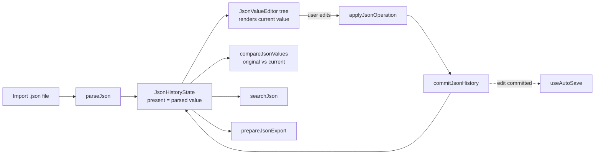

# Editor model

This page describes the JSON domain layer in [`src/core/json`](../../src/core/json) and how the editing UI drives it. It assumes the layering described in [Architecture overview](overview.md).

## Contents

- [Document flow](#document-flow)
- [Types and paths](#types-and-paths)
- [Operations](#operations)
- [History (undo/redo)](#history-undoredo)
- [View inference](#view-inference)
- [Search](#search)
- [Comparison](#comparison)
- [Image detection](#image-detection)
- [Export](#export)
- [Rendering performance](#rendering-performance)

## Document flow



[`useJsonDocument`](../../src/composables/useJsonDocument.ts) owns this loop: it holds `document` (file name, `original`, `current`) and `history` (`JsonHistoryState`) as `shallowRef`s, and exposes computed state (`changes`, `canUndo`, `canRedo`, `hasUnexportedChanges`, etc.) derived from them. Every edit becomes an `JsonEditorOperation`, which the composable applies through the domain layer and, if it produced a real change, commits to history and increments a monotonic `editVersion` counter. `useAutoSave` watches `editVersion` — not the document itself — so that programmatic state replacement (like resuming a session) doesn't get mistaken for a user edit (see [Local persistence](local-persistence.md)).

## Types and paths

[`types.ts`](../../src/core/json/types.ts) defines the value model:

```ts
type JsonPrimitive = string | number | boolean | null
type JsonObject = { [key: string]: JsonValue }
type JsonArray = JsonValue[]
type JsonValue = JsonPrimitive | JsonObject | JsonArray
type JsonPathSegment = string | number
type JsonPath = JsonPathSegment[]
```

A path is an array of segments, not a dot-joined string, so a property literally named `a.b` or containing a space is addressed unambiguously. [`path.ts`](../../src/core/json/path.ts) formats a path for display as `$["key"][0]` (see `formatJsonPath`), and provides equality/prefix helpers used for highlighting and expansion.

[`parser.ts`](../../src/core/json/parser.ts) turns file text into a `JsonValue`, rejecting four cases with a dedicated error code and English message: an empty file, invalid JSON syntax, an integer outside `Number.isSafeInteger` range, and a numeric literal that parses to a non-finite value. It re-scans the raw source text for number literals (outside of strings) specifically to catch precision loss that `JSON.parse` itself would silently normalize.

## Operations

[`operations.ts`](../../src/core/json/operations.ts) is the only place allowed to produce a new document root. Every function takes the current root and returns a `JsonOperationResult` (`{ ok: true, value }` or `{ ok: false, error }`); nothing mutates in place. The supported operations are the members of the `JsonEditorOperation` union: `set-value`, `replace-root`, `change-type`, `rename-property`, `add-property`, `append-item`, `duplicate-array-item`, `duplicate-property`, `move-array-item`, `move-property`, `remove-value`.

Implementation notes confirmed by the source and by [`operations.test.ts`](../../src/core/json/operations.test.ts):

- `replaceAtPath` copies only the objects/arrays along the edited path (`{...current, [segment]: child}` / `[...current]` at each level) — siblings outside the path keep their original object identity. Combined with `commitJsonHistory` retaining the previous snapshot by reference (see below), this gives the document tree structural sharing across edits: an edit deep in a large document does not clone the whole tree.
- Renaming or adding a property rejects a name that already exists (`duplicate-key`).
- Duplicating a property or array item uses `cloneJsonValue`, a full deep copy, and (for properties) `createUniquePropertyName` generates an English `"<name> (copy)"` / `"<name> (copy) 2"` suffix.
- `canReorderJsonObject` returns `false` if any key looks like an array index (a non-negative integer under `4294967295` written in canonical form). JavaScript objects enumerate such keys in numeric order regardless of insertion order, so the UI disables manual property reordering for those objects rather than show a control that wouldn't do anything.
- Every numeric value, at any depth, is validated by `validateNumbers` before it's accepted: it must be finite and, if an integer, within `Number.isSafeInteger` range.

## History (undo/redo)

[`history.ts`](../../src/core/json/history.ts) implements `JsonHistoryState` as `{ past, present, future, limit, grouping }`, with `DEFAULT_HISTORY_LIMIT = 50` (past and future are each capped at 50 entries) and `DEFAULT_TYPING_GROUP_WINDOW_MS = 750`.

- `commitJsonHistory` pushes `present` onto `past` and sets the new value as `present`, clearing `future` (a new edit discards redo). If the commit carries the same `groupKey` as the previous one *and* arrives within the 750 ms window, it is merged into the current step instead of creating a new one — this is what makes continuous typing in one field a single undo step.
- `undoJsonHistory` / `redoJsonHistory` move the `present` pointer between `past`/`future` without touching anything else in the tree.
- Snapshots are plain references to prior `JsonValue` trees, not deep clones made on every commit — this is deliberate (see the comment in `commitJsonHistory`) so that diffing and equality checks can short-circuit on unchanged subtrees, and so history doesn't multiply memory use per step beyond the parts that actually changed.

`useJsonDocument.restoreOriginal()` restores the document by *committing* `document.original` as a new history entry (not by resetting history), so restoring is itself undoable.

Keyboard shortcuts (`JsonDocumentEditor.vue`, `handleHistoryShortcut`): `Ctrl+Z`/`Cmd+Z` for undo, `Ctrl+Y` or `Ctrl/Cmd+Shift+Z` for redo, ignored while focus is on an `input`, `textarea`, `select`, or a `contenteditable` element so the browser's native per-field text undo still works.

## View inference

[`analyzer.ts`](../../src/core/json/analyzer.ts) decides how a collection is initially displayed. `JsonCollectionView` is a closed union of exactly three values: `'form' | 'table' | 'list'` (labelled **Form**, **Table**, and **Cards** in the UI — see `viewLabel` in `JsonValueEditor.vue`). There is no fourth "tree" mode: earlier revisions of this project had one (see the `068f8957` commit removing it from the view switcher), but the current `JsonCollectionView` type, `analyzer.ts`, and `analyzer.test.ts` confirm it no longer exists. A nested object or array inside a Cards item still renders recursively, so the *result* looks hierarchical, but the UI never labels this a distinct "tree" view — it's the same Cards view recursing into itself.

`analyzeArrayShape` classifies an array as:

| `kind` | Condition |
|---|---|
| `'simple'` | Empty, or every item is a non-object, non-array value. |
| `'uniform-objects'` | Every item is an object, the union of all keys across items is at most 16, and every item fills at least 50% of that union. |
| `'irregular'` | Anything else (mixed types, nested arrays/objects that don't fit the table shape, or object arrays that fail the width/fill test). |

`getDefaultCollectionView` / `getCompatibleCollectionViews` only special-case `'uniform-objects'` (default **Table**, with **Cards** also offered): every other array — `'simple'` *and* `'irregular'` alike — gets exactly one compatible view, **Cards**. The view switcher itself is only rendered when more than one view is compatible, so it only ever appears for uniform-object arrays.

Table columns follow first-appearance order across items (`[...new Set(items.flatMap(Object.keys))]`), not alphabetical or schema order, and a property name (`id`, `title`, `image`, …) never influences the `kind` decision.

## Search

[`search.ts`](../../src/core/json/search.ts) walks the current value depth-first from the root, case-insensitively matching the query against a property's key, a primitive's string form, and the formatted path itself, and returns up to `maxResults` (default 250) `JsonSearchResult` entries in traversal order — it does not rank by relevance. `JsonSearchPanel.vue` debounces input by 180 ms before calling `searchJson`. Search only reads the document; it never mutates it or attaches interface metadata to it.

## Comparison

[`diff.ts`](../../src/core/json/diff.ts) compares `original` and `current` structurally, walking objects and arrays recursively. Object keys are compared as sets (property order is not semantic); array items are compared positionally except for one special case: if two arrays have the same length (≥ 2) and the exact same multiset of items in a different order, the whole array is reported as a single `'reordered'` change instead of per-index `'added'`/`'removed'`/`'changed'` entries. Equality for this purpose is a stable, key-sorted JSON fingerprint (`stableFingerprint`), so two structurally-equal objects with differently-ordered keys still count as "the same item" for reorder detection.

## Semantic detection

[`semantic.ts`](../../src/core/json/semantic.ts) is a pure, bounded detector for supported primitive interpretations: ISO dates/date-times, plausible Unix timestamps, HTTP(S) URLs, direct raster-image/GIF/video links, common Git hosts, CSS colors, email addresses, UUIDs, long text, embedded JSON, and safe raster `data:image/...` values. Detection is based on content rather than property names and uses a 1,000-entry FIFO cache so unchanged strings do not repeat parsing/URL work during reactive renders.

The detector returns metadata only; it cannot emit an editor operation or rewrite the value. `SemanticBadge.vue` turns a result into an optional inspection control, and `SemanticInspector.vue` renders the selected result. Embedded JSON parsing is capped at 20,000 characters, data images at 1,000,000 characters, and remote URLs at 4,096 characters. SVG data, non-HTTP protocols, and arbitrary web pages are excluded.

Remote media sources are assigned to ``/`<video>` only after the user activates **Load preview**. External links use `noopener`, `noreferrer`, and `referrerpolicy="no-referrer"`; derived URL metadata excludes credentials and query strings. None of these presentation rules affect history, comparison, auto-save, or export.

## Export

[`exporter.ts`](../../src/core/json/exporter.ts) validates the current value immediately before serializing: it rejects non-finite/unsafe numbers, circular references, sparse array holes, and objects with a non-plain prototype. `serializeJson` calls `JSON.stringify(value, null, formatting === 'formatted' ? 2 : 0)` — formatted output uses two-space indentation, compact output uses none. [`downloadJson.ts`](../../src/features/export/downloadJson.ts) creates a `Blob`, triggers a browser download via a temporary `<a download>` element, and revokes the object URL immediately after (`URL.revokeObjectURL` on a `setTimeout(0)`).

## Rendering performance

A few specific, tested techniques keep the recursive editor usable on larger documents — these are implementation details, not user-facing features, but they explain some behavior a developer might otherwise mistake for a bug:

- **Deferred mounting**: a collapsed object/array's body is not mounted at all until it is first expanded (`bodyMounted` in `JsonValueEditor.vue`), except at depth 0–1 which start expanded. Confirmed by [`tests/editorPerformance.test.ts`](../../tests/editorPerformance.test.ts).
- **`v-memo` on fields/rows/cards**: object property fields, table rows, and card items are wrapped in `v-memo` keyed on the child value, its index, whether it's the last item, and the props that affect its rendering — an edit to one field does not force Vue to re-diff every sibling.
- **Structural sharing**: as described under [Operations](#operations), an edit only creates new object/array references along the edited path; combined with `history.ts` keeping snapshots by reference, unrelated subtrees are shared, not copied, across history entries.
- **`shallowRef` for document/history state**: `useJsonDocument` stores `document`, `history`, and `lastExported` in `shallowRef`s rather than deep `ref`s, since the domain layer already treats these values as immutable and replaces them wholesale on every change — deep reactivity on a large JSON tree would be pure overhead.

## Known, intentionally-not-fixed limitation

`JsonValueEditor.vue`'s Cards/list rendering (`<ol class="array-items">`) keys each item by its array index (`:key="index"`), documented in-line in the component:

> Deleting/reordering an earlier item reuses this child `JsonValueEditor` for a different array element, so its local state (expanded, view mode, selected item, …) can be displayed against the wrong item.

The same file explains why this isn't a quick fix: resetting local state whenever `props.value` changes would also fire on the user's own edits to nested content *within the same item* (any nested edit produces a new object reference along the whole ancestor chain), collapsing or resetting a section the user is actively editing — a worse regression than the one it would fix. A correct fix needs stable per-item identity, which plain JSON arrays don't have and this application deliberately does not synthesize. This is tracked as a known limitation — see [Limitations](../limitations.md).
