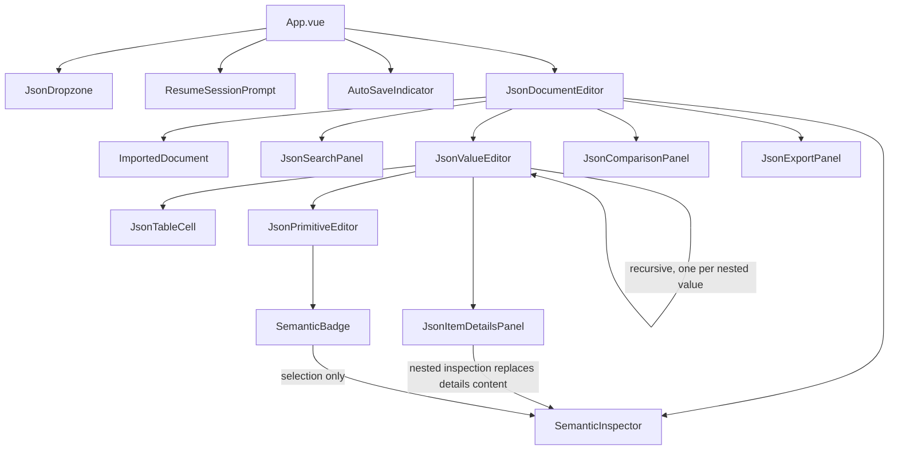

# Architecture overview

JSON Visual Editor is a client-only single-page application built with Vue 3, TypeScript, and Vite. There is no backend: every feature described here — import, editing, history, search, comparison, export, and local auto-save — runs in the browser.

This page describes how the codebase is layered. For the JSON editing model itself, see [Editor model](editor-model.md). For the local auto-save/IndexedDB system, see [Local persistence](local-persistence.md).

## Layers

The codebase separates three concerns:

```text
src/
├── core/json/        Domain layer — pure functions, no Vue import
├── composables/       Vue state — document, history, auto-save, theme, dialog focus
├── features/           Feature UI — components grouped by user-facing capability
├── components/         Small shared components (auto-save indicator, brand mark)
├── workers/             Web Worker(s) used by the composables layer
└── styles/               One shared stylesheet
```

- **`src/core/json`** is the domain layer: parsing, structural and semantic analysis, immutable operations, history, diffing, search, export, and session (de)serialization. Every file here is plain TypeScript with no Vue dependency, so it is testable in isolation and can't accidentally couple document rules to component state. `semantic.ts` is a bounded, memoized detector registry; it derives display metadata but never returns an editor operation.
- **`src/composables`** hold Vue-reactive state and side effects: [`useJsonDocument`](../../src/composables/useJsonDocument.ts) owns the loaded document, history, and export/restore actions; [`useAutoSave`](../../src/composables/useAutoSave.ts) owns IndexedDB persistence and wraps the subset of `useJsonDocument`'s actions it needs to react to; [`useTheme`](../../src/composables/useTheme.ts) and [`useDialogFocus`](../../src/composables/useDialogFocus.ts) are smaller, single-purpose composables.
- **`src/features`** contain the UI, grouped by capability: `editor` (the recursive editor, table, dialogs), `import` (drop zone, resume-session prompt), `search`, `comparison`, `export`. Components receive data as props and emit typed operations; they do not mutate the document directly.
- **`src/workers`** currently has one Web Worker, used by `useAutoSave` to measure a recovery snapshot's size off the main thread.

[`App.vue`](../../src/App.vue) is the composition root: it calls `useTheme`, `useJsonDocument`, and `useAutoSave`, wires their return values together, and renders the header, the import/editor views, the auto-save indicator, and the footer.

## Component map



`JsonValueEditor` is the only component that renders itself recursively: an object's properties and an array's items are each a nested `JsonValueEditor`, selected by the actual runtime type of the value at that path. This is what makes the editor generic — it never assumes a schema. Primitive editors ask the pure semantic detector for an optional interpretation. A direct request rises to the single inspector state in `JsonDocumentEditor`. When the request starts inside Item Details, `contextualSurface.ts` keeps the selected row and switches the existing details surface to embedded inspector content; returning restores the same row instead of mounting a second top-level panel. This UI-only state machine never emits a document operation.

## Technology choices

| Concern | Choice | Notes |
|---|---|---|
| UI framework | Vue 3 (`^3.5`), `<script setup>` SFCs | The only runtime dependency in `package.json`. |
| Build tool | Vite 7 | Also serves the dev server and powers `vitest`. |
| Language | TypeScript 5.9, strict mode | See [Code quality](../development/code-quality.md) for the exact compiler flags. |
| Tests | Vitest | Runs in a Node environment (`test.environment: 'node'` in [`vite.config.ts`](../../vite.config.ts)), with `jsdom`-like globals stubbed manually where a test needs `window`/`document`/IndexedDB behavior. |
| Linting | ESLint 10 (flat config) with `typescript-eslint` and `eslint-plugin-vue` | `npm run lint` runs with `--max-warnings=0`. |
| State management | None | No Pinia/Vuex/Redux. Document state lives in `useJsonDocument`; UI-only state (search query, selection, active path) lives in the components that need it. |
| Styling | One hand-written stylesheet ([`src/styles/base.css`](../../src/styles/base.css)) | CSS custom properties drive light/dark theming; no CSS framework or CSS-in-JS. |
| Table/grid | None | The table view in `JsonValueEditor.vue` is a plain semantic `<table>`. |

There is no router (the application has a single view), no HTTP client (there is no backend to call), and no schema-validation library (JSON structure is inferred at runtime, not declared).

## Where to go next

- [Editor model](editor-model.md) — the JSON domain layer and the import → edit → history → export flow.
- [Local persistence](local-persistence.md) — the IndexedDB-backed auto-save system.
- [Project structure](../development/project-structure.md) — a file-by-file map of `src/`.
